# Digital Pet Backend - LLM服务架构详解

> 为新手开发者准备的大模型服务架构学习文档

---

## 📐 整体架构图

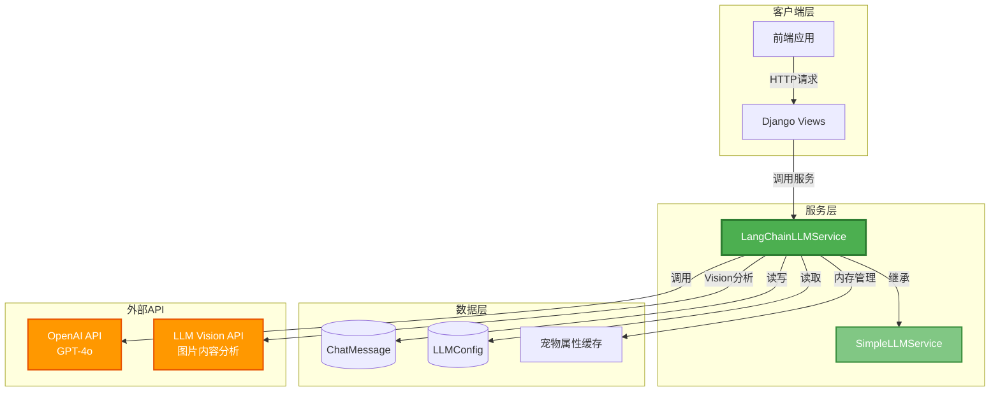

---

## 🏗️ 类继承关系

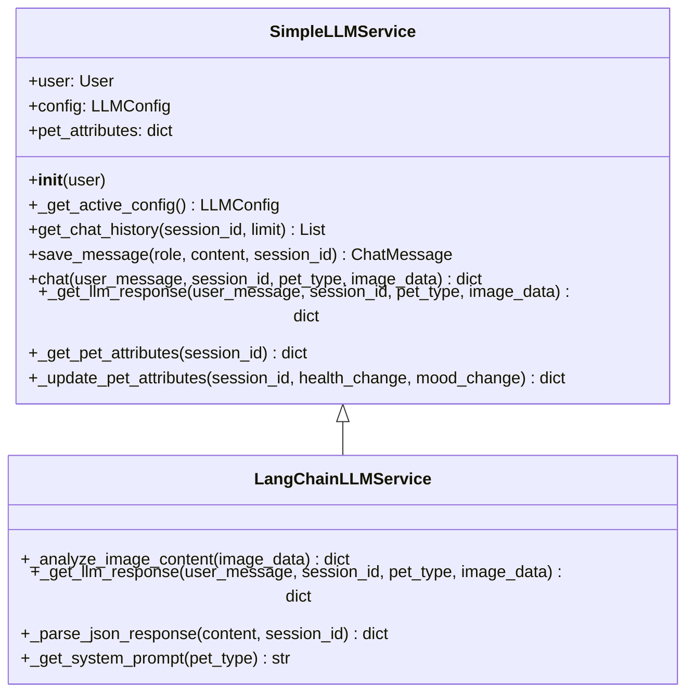

---

## 🔄 核心业务流程

### 1️⃣ 完整聊天流程

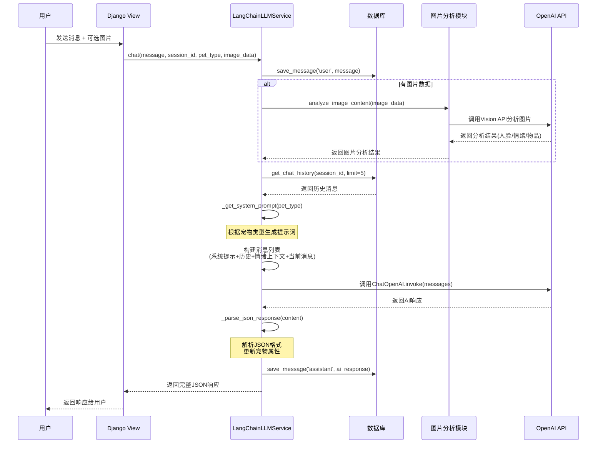

---

### 2️⃣ 图片分析流程（微表情专家模式）

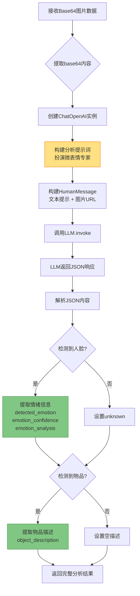

---

### 3️⃣ JSON响应解析流程

```mermaid
flowchart TD
    A[接收AI返回的content] --> B{是否包含```json标记?}
    
    B -->|是| C[使用正则提取JSON<br/>```json\s*{...}\s*```]
    B -->|否| D{是否包含message字段?}
    
    C --> E[json.loads解析]
    D -->|是| F[直接提取JSON对象]
    D -->|否| G[将整个content作为JSON]
    
    F --> E
    G --> E
    
    E --> H{解析成功?}
    
    H -->|成功| I[提取必需字段]
    H -->|失败| J[返回默认格式]
    
    I --> K[构建标准响应对象<br/>result, message, options,<br/>health, mood]
    
    K --> L[更新宠物属性缓存<br/>pet_attributes]
    
    J --> M[使用默认值<br/>content作为message]
    
    L --> N[返回格式化响应]
    M --> N
    
    style I fill:#4CAF50,stroke:#2E7D32
    style K fill:#4CAF50,stroke:#2E7D32
    style J fill:#FF9800,stroke:#E65100
```

---

## 🎭 三种宠物人格系统

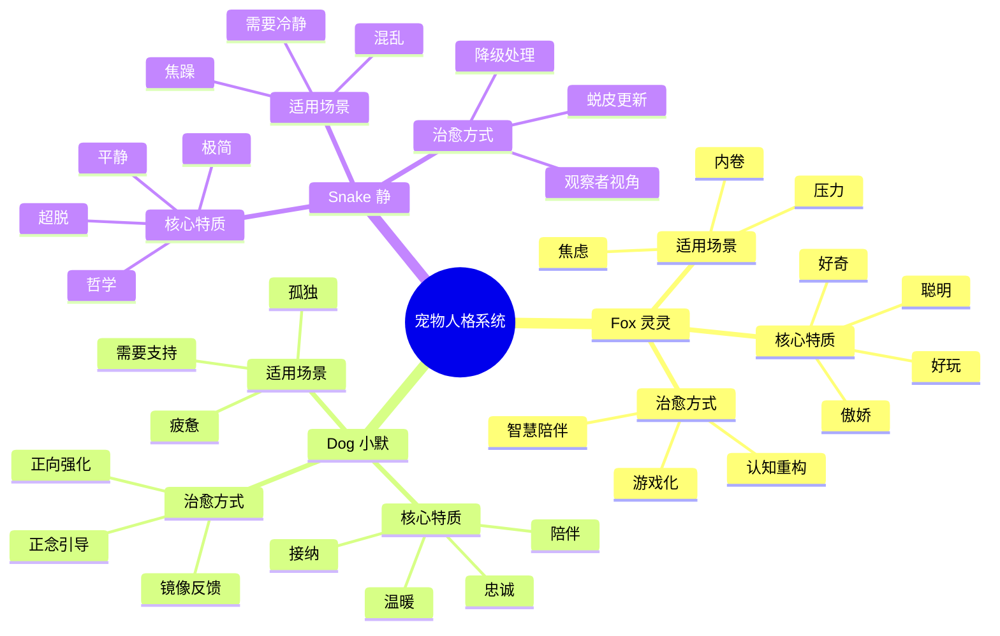

---

## 📊 数据流转图

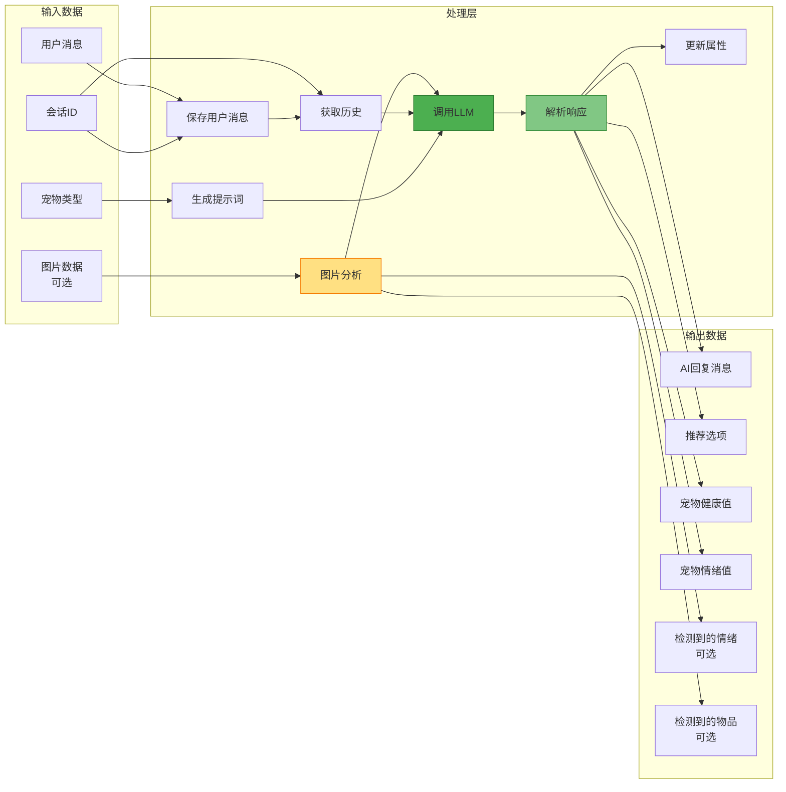

---

## 🔧 核心组件详解

### 📦 SimpleLLMService（基础服务类）

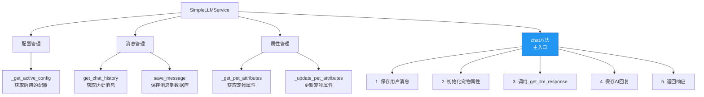

---

### 🚀 LangChainLLMService（完整版）

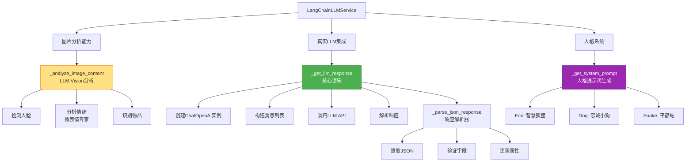

---

## 💾 数据模型

```mermaid
erDiagram
    User ||--o{ ChatMessage : has
    User {
        int id PK
        string username
        string email
    }
    
    ChatMessage {
        int id PK
        int user_id FK
        string role
        text content
        string session_id
        datetime created_at
    }
    
    LLMConfig {
        int id PK
        string provider
        string model_name
        string api_key
        string api_base
        float temperature
        int max_tokens
        boolean is_active
    }
    
    PetAttributes {
        string session_id PK
        int health
        int mood
        note "内存存储，非数据库"
    }
```

---

## 🎯 关键技术点

### 1. 多模态处理（Vision + Text）

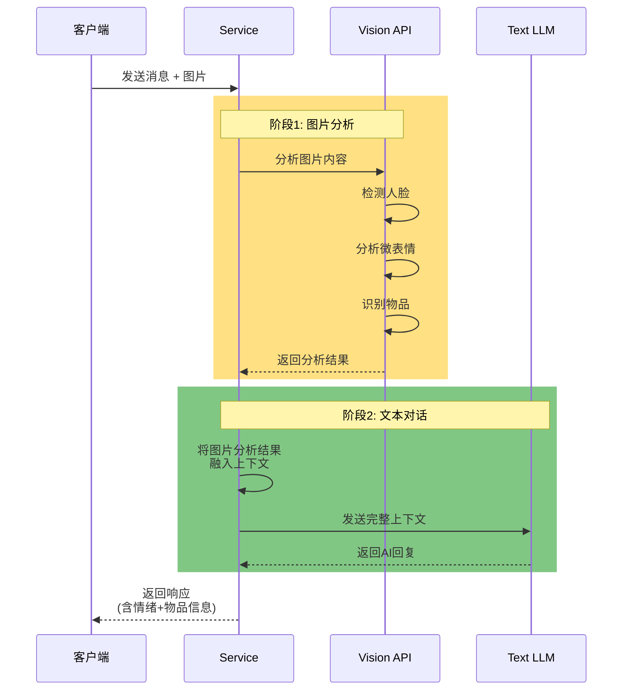

---

### 2. 上下文管理策略

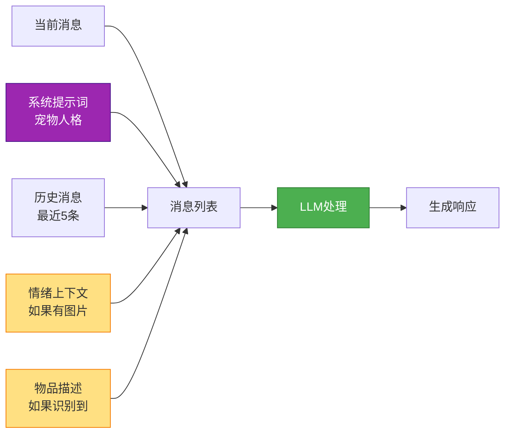

---

### 3. 属性驱动的交互系统

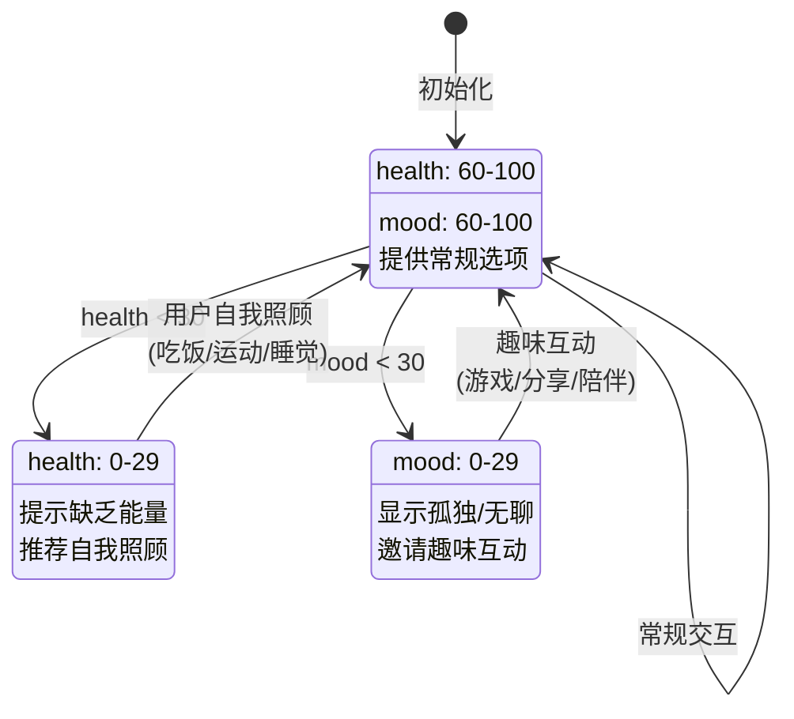

---

## 📝 JSON响应格式标准

```json
{
  "result": true,
  "message": "AI回复消息（含动作描述）",
  "options": [
    "选项1（≤5词）",
    "选项2（≤5词）",
    "选项3（≤5词）"
  ],
  "health": 85,
  "mood": 90,
  "detected_emotion": "happy",
  "emotion_confidence": 0.95,
  "emotion_analysis": "微表情分析结果",
  "detected_objects": "识别到的物品描述"
}
```

---

## 🛡️ 隐私保护设计

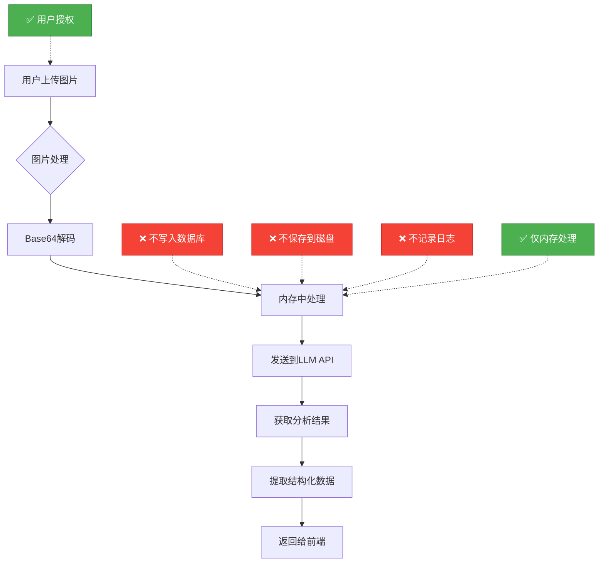

---

## 🚀 快速上手指南

### 开发者学习路径

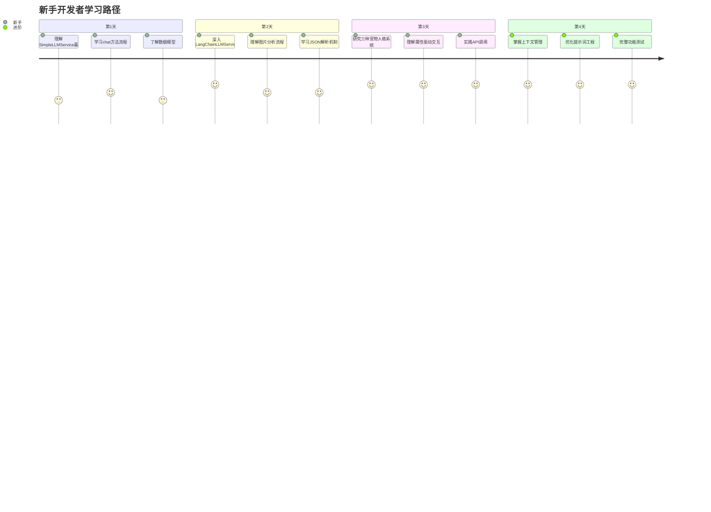

---

## 💡 关键设计模式

### 1. 继承模式
- **SimpleLLMService**: 基础框架，易于理解
- **LangChainLLMService**: 完整实现，生产就绪

### 2. 策略模式
- 根据`pet_type`动态选择人格提示词
- 三种宠物对应三种治愈策略

### 3. 模板方法模式
- `chat()`方法定义骨架流程
- 子类重写`_get_llm_response()`实现细节

### 4. 工厂模式
- `_get_system_prompt()`根据类型生成不同提示词

---

## 🔍 调试技巧

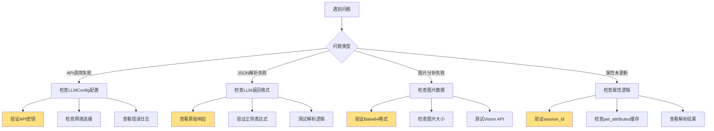

---

## 📚 扩展阅读

1. **LangChain官方文档**: https://python.langchain.com/
2. **OpenAI Vision API**: https://platform.openai.com/docs/guides/vision
3. **Prompt Engineering指南**: 提示词工程最佳实践
4. **Django ORM**: 数据库操作深入理解

---

## ✅ 总结

这个LLM服务架构的核心优势：

1. ✨ **模块化设计**: 清晰的继承结构，易于扩展
2. 🎭 **多人格系统**: 三种宠物对应不同治愈场景
3. 👁️ **多模态能力**: 支持图片 + 文本混合输入
4. 🔒 **隐私优先**: 图片仅内存处理，不持久化
5. 📊 **属性驱动**: 通过健康值和情绪值引导用户自我照顾
6. 🎯 **选项推荐**: 智能生成3个快速选项，降低用户决策负担

---

**祝学习愉快！🎉**
